# Secure and Fast API Calls with Workspace ONE UEM

## Introduction

Workspace ONE UEM is a powerful platform for managing and securing mobile devices, but it also offers a robust API for integrating with other systems. This API can be used to automate workflows, monitor device status, and trigger alerts based on device events. However, managing API calls, security, tokens, and environment variables can be complex and time-consuming. 

This blog post will outline best practices for managing API workflows in Workspace ONE UEM, including how to securely manage API calls, tokens, and environment variables. We will also explore how to use Postman/Bruno to assist with development and automation tasks.

## Table of Contents

- [API Workflows with Workspace ONE UEM](#api-workflows-with-workspace-one-uem)
  - [Introduction](#introduction)
  - [Table of Contents](#table-of-contents)
  - [1 Secure API Calls](#1-secure-api-calls)
    - [1.1 Environment Variables and Secrets Management](#11-environment-variables-and-secrets-management)
    - [1.2 Code Examples: Using Environment Variables with Python and PowerShell](#12-code-examples-using-environment-variables-with-python-and-powershell)
      - [Python](#python)
      - [PowerShell](#powershell)
  - [2. Authentication and Token Management](#2-authentication-and-token-management)
    - [2.1 Basic Authentication](#21-basic-authentication)
    - [2.2 OAuth 2.0](#22-oauth-20)
      - [2.2.1 Getting Client ID and Client Secret](#221-getting-client-id-and-client-secret)
      - [2.2.2 Getting Bearer Tokens](#222-getting-bearer-tokens)
        - [Postman/Bruno](#postmanbruno)
        - [Python](#python-1)
        - [PowerShell](#powershell-1)
  - [3. API Calls with Bearer Tokens](#3-api-calls-with-bearer-tokens)
    - [3.1 Using Postman/Bruno to call an API](#31-using-postmanbruno-to-call-an-api)
    - [3.2 Using Python to call an API](#32-using-python-to-call-an-api)
    - [3.3 Using PowerShell to call an API](#33-using-powershell-to-call-an-api)
  - [Conclusion](#conclusion)


## 1 Secure API Calls

When working with API scripts, security should be a top priority.

### 1.1 Environment Variables and Secrets Management

- Store sensitive credentials like API keys, client IDs, and secrets in environment variables rather than hardcoding them in scripts
- Use dedicated environment management tools like Postman environments and .env files for development
- for Production and CI/CD use a cloud based key vault like Azure Key Vault, AWS Secrets Manager, or Google Cloud Secret Manager
- Never commit credentials to version control

Example environment setup in Postman ( These are sample values ):

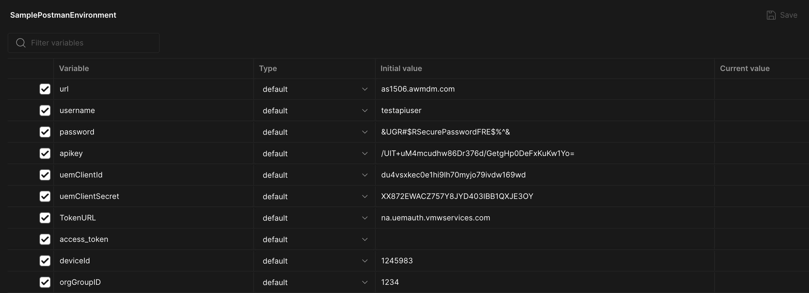

### 1.2 Code Examples: Using Environment Variables with Python and PowerShell

Here's an example of how to securely manage API credentials using a .env file in Python and PowerShell:

Your .env file should look like this:

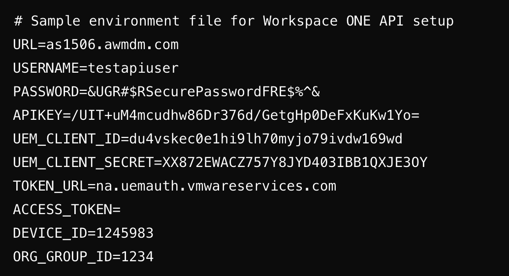


#### Python

use pip to install python-dotenv

```bash
pip install python-dotenv
```

Here is the python code to load the environment variables and access the API_KEY:

```python
import os
from dotenv import load_dotenv
load_dotenv()

api_key = os.getenv("API_KEY")
print(api_key)
```

#### PowerShell
It is a little more difficult in powershell since you have to use your own function to load the environment variables.
Here is an example function and how you can use it:

```powershell
# Function to load environment variables from .env file
function LoadEnvVariables
{
    $current_path = $PSScriptRoot
    if ($null -eq $current_path)
    {
        $current_path = Get-Location
    }

    while (-not (Test-Path "$current_path/.env"))
    {
        $current_path = Split-Path $current_path
        if ($null -eq $current_path)
        {
            Write-Host "No .env file found. Are you setting them elsewhere?"
            break
        }
    }

    # If .env file is found, load it
    if (Test-Path "$current_path/.env")
    {
        get-content $current_path/.env | ForEach-Object {
            $line = $_.Trim()
            if ($line -and -not $line.StartsWith("#"))
            {
                $equals = $line.IndexOf("=")
                if ($equals -gt 0)
                {
                    $name = $line.Substring(0, $equals).Trim()
                    $value = $line.Substring($equals + 1).Trim().Trim("'")

                    Set-Item -Path Env:\"$name" -Value "$value"
                }
            }
        }
    }
}
LoadEnvVariables
 # Access the APIKEY environment variable
$api_key = $Env:APIKEY

# Output to verify if $api_key is correctly set
Write-Host "Retrieved APIKEY from environment: $api_key" 
```

Both of these examples will work when
- using a .env file
- when exporting the environment variables in the terminal

## 2. Authentication and Token Management

There are two ways to authenticate with the Workspace ONE UEM API.

1. OAuth 2.0
2. Basic Authentication

### 2.1 Basic Authentication

I will not be covering Basic Authentication in this blog post since it is not recommended for most use cases due to:

- It uses a username and password which are tied to a users account
- Passwords are user generated and therefore CAN be less secure than a machine generated token
- Normally organizations require you to change the password every 30-60 days which means you will have to update the script with a new password each time
- It is not supported for all API endpoints
- it is slower than OAuth 2.0 which can be an issue if you are making a large number of API calls

### 2.2 OAuth 2.0

OAuth 2.0 is the recommended authentication method for the Workspace ONE UEM API since it is more secure and flexible:

- It is tied to an authentication profile and not a user account
- It uses a separate endpoint for authentication which is more secure due to separation of duties
- The authentication endpoint is a single purpose endpoint and only used for authentication
- Therefore it is not under development as much and if a vulnerability is found, it can be fixed very quickly since it is not used for anything else
- The Tokens expire so if any token is leaked, it will be invalid after a short period of time
- It is supported for all API endpoints
- If you have a long running script, you can use a refresh token to get a new access token when the current access token is about to expire

#### 2.2.1 Getting Client ID and Client Secret

First create an authentication profile in the Workspace ONE UEM Console:

You access it from Groups and Settings -> Configurations -> OAuth Client Management

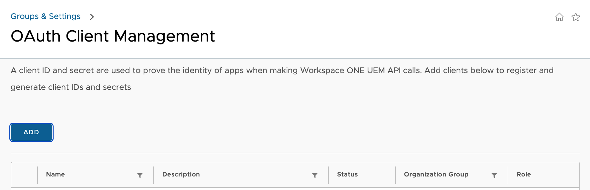

Click Add and fill out the form:

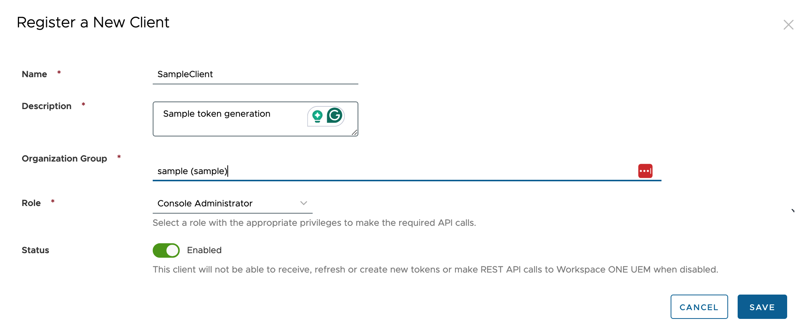

Once you click save you are shown your Client ID and Client Secret.  You only get to see this once so make sure to save it in a secure location.   Then you can add them to your postman environment variables or .env file.

#### 2.2.2 Getting Bearer Tokens

At this point you can use your client ID and client secret to get a bearer token which you can then use to make API calls.  Here I will show how to do this using Postman/Bruno, Python, and PowerShell.

##### Postman/Bruno

Since you have your environment setup, you can use the following request to get a bearer token using the variables you setup in the environment:

This shows the setup in Postman/Bruno using the TokenURL variable:
Note that the content-type header is x-www-form-urlencoded

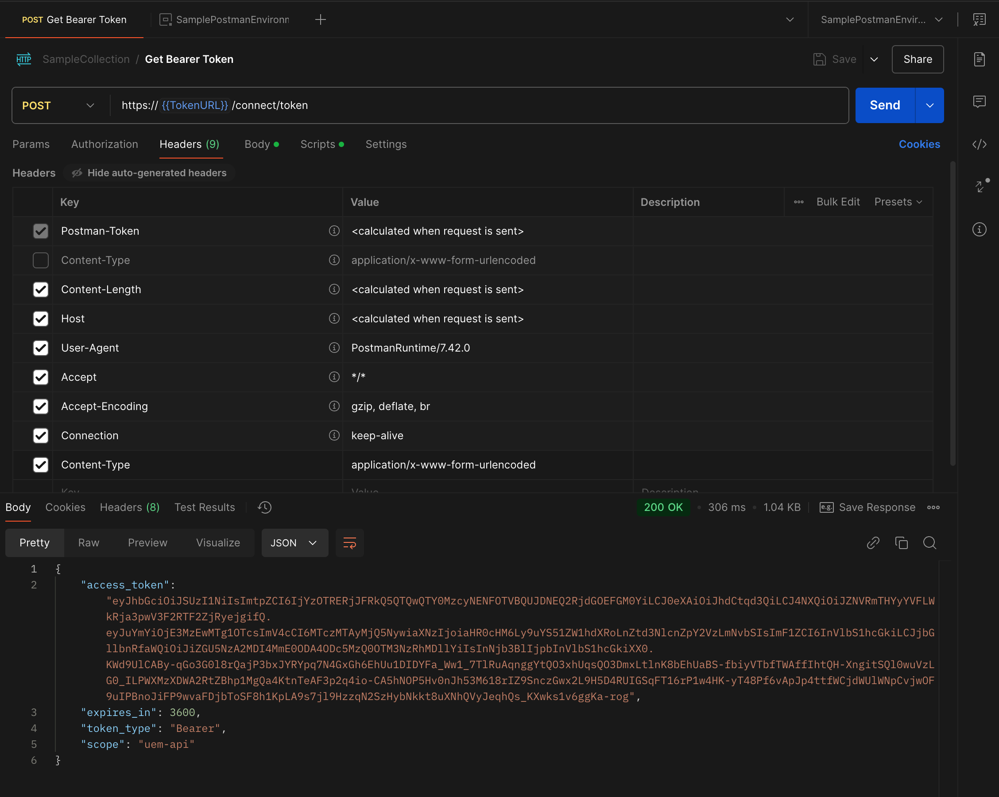

This shows the body which uses the uemClientId and uemClientSecret variables in the environment:

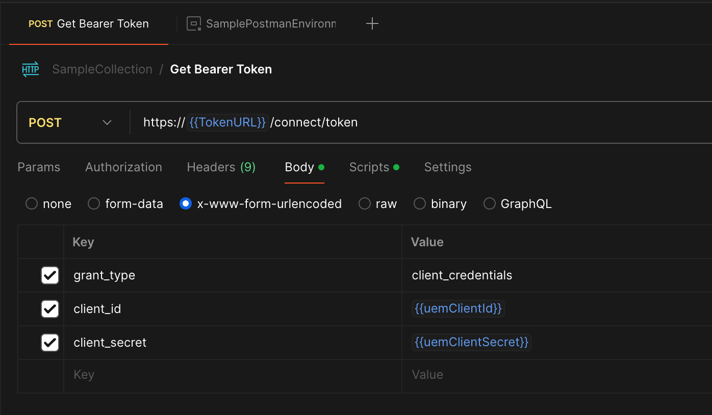

Both Postmand and Bruno have a post-response script option which you can use to parse the response and extract the access token and expiration time.

Here is an example of the post-response script for Postman:

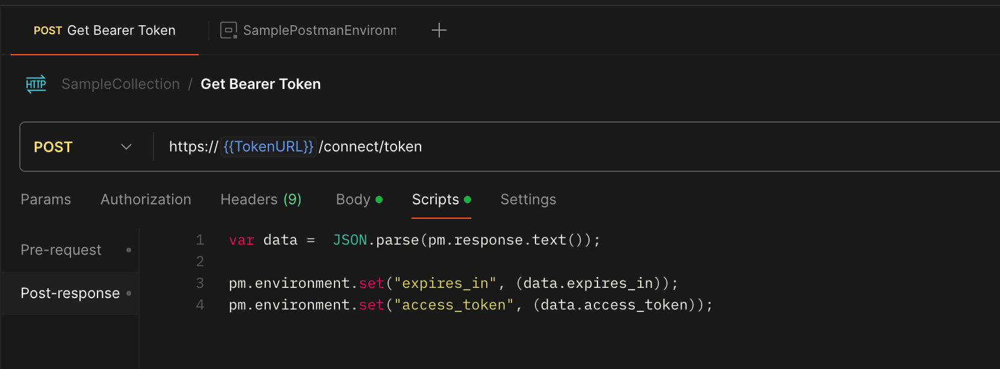

Now your environment variables will have the access token and expiration time:

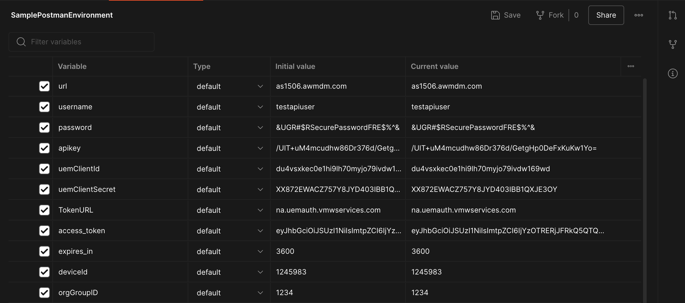

Later we will explore how to use the access token to make API calls in Postman/Bruno.


##### Python

Here is an example of how to use the requests library to get a bearer token.

The steps are:

1. Load the environment variables
2. Setup the global variables for caching the token
3. Define a function to make API requests with error handling
4. Define a function to get a bearer token with caching
5. Call the function and print the token

```python

import requests
import os
from dotenv import load_dotenv
from datetime import datetime, timedelta
load_dotenv()
HOST = os.getenv("HOST")
API_KEY = os.getenv("API_KEY")
CLIENT_ID = os.getenv("CLIENT_ID")
CLIENT_SECRET = os.getenv("CLIENT_SECRET")

AUTH_HOST = "na.uemauth.vmwservices.com"

# Global variables for caching the token
bearer_token = ""
script_run_time = datetime.now()
token_expiry = script_run_time
expires_in = 0

# Function to handle API requests with error handling
def make_request(method, url, headers=None, data=None):
    try:
        response = requests.request(method, url, headers=headers, data=data)
        response.raise_for_status()  # Raise an exception for HTTP errors
        return response
    except requests.exceptions.HTTPError as http_err:
        print(f"HTTP error occurred: {http_err}")
    except requests.exceptions.ConnectionError as conn_err:
        print(f"Connection error occurred: {conn_err}")
    except requests.exceptions.Timeout as timeout_err:
        print(f"Timeout error occurred: {timeout_err}")
    except requests.exceptions.RequestException as req_err:
        print(f"An error occurred: {req_err}")
    return None


# Function to get Bearer Token with caching
def get_bearer_token():
    global bearer_token, token_expiry, expires_in

    current_time = datetime.now()
    if bearer_token and token_expiry > current_time + timedelta(seconds=expires_in):
        return bearer_token

    url = f"https://{AUTH_HOST}/connect/token"
    payload = f'grant_type=client_credentials&client_id={CLIENT_ID}&client_secret={CLIENT_SECRET}'
    headers = {
        'Content-Type': 'application/x-www-form-urlencoded',
        'User-Agent': 'Chrome',
        'Accept': 'application/json'
    }
    response = make_request("POST", url, headers=headers, data=payload)
    if response is None:
        sys.exit("Failed to obtain access token.")

    response_json = response.json()
    bearer_token = response_json["access_token"]
    expires_in = response_json["expires_in"]
    token_expiry = current_time + timedelta(seconds=expires_in - 120)  # 2 minute buffer

    return bearer_token

print(get_bearer_token())
```

##### PowerShell

Here I am not showing the LoadEnvVariables function since it is the same as the one shown earlier.

The steps are:

1. Load the environment variables
2. Setup the global variables for caching the token
3. Define a function to make API requests with error handling
4. Define a function to get a bearer token with caching
5. Call the function and print the token

```powershell
# Load the environment variables
LoadEnvVariables

# A function to make API requests with proper error handling
function Invoke-ApiRequest
{
    param (
        [string]$Method,
        [string]$Uri,
        [hashtable]$Headers,
        [hashtable]$Body = $null
    )

    try
    {
        if ($Method -eq "Post")
        {
            return Invoke-RestMethod -Uri $Uri -Method $Method -Headers $Headers -Body $Body
        }
        else
        {
            return Invoke-RestMethod -Uri $Uri -Method $Method -Headers $Headers
        }
    }
    catch
    {
        Write-Error "Error calling API: $Uri"
        Write-Error $_.Exception.Message
        return $null
    }
}

# Global variables for caching the token
$bearer_token = ""
# set the script run time as a reference
$script_run_time = [DateTime]::Now
$token_expiry = $script_run_time
$expires_in = 0

# Function to get Bearer Token
function Get-BearerToken
{
    $current_time = [DateTime]::Now
    if ($bearer_token -ne "" -and $token_expiry -gt $current_time.AddSeconds($expires_in))
    {
        return $bearer_token
    }

    $url = "https://na.uemauth.vmwservices.com/connect/token"
    $payload = @{
        grant_type = "client_credentials"
        client_id = $env:CLIENT_ID
        client_secret = $env:CLIENT_SECRET
    }
    $headers = @{
        'Content-Type' = 'application/x-www-form-urlencoded'
        'User-Agent' = 'Chrome'
        'Accept' = 'application/json'
    }

    $response = Invoke-ApiRequest -Method "Post" -Uri $url -Headers $headers -Body $payload
    if ($null -eq $response)
    {
        Write-Error "Failed to obtain access token."
        exit 1
    }

    $global:bearer_token = $response.access_token
    $global:token_expiry = $current_time.AddSeconds($response.expires_in - 120) # 2 minute buffer
    $global:expires_in = $response.expires_in
    return $global:bearer_token
}

```

Now that you have a bearer token, you can use it to make API calls.  We will explore how to do this in the next section.


## 3. API Calls with Bearer Tokens

Now that you understand how to:

- Setup an authentication profile
- Store your credentials securely
- Get a bearer token

You can use the following methods to call an API:

For all three methods, I will use a request to get a list of devices from the Workspace ONE UEM API.  I am using
the system api to get a basic list of devices without all the extra data.

### 3.1 Using Postman/Bruno to call an API

Here is the setup in Postman/Bruno which uses the bearer token in the Authorization tab:

Notice I am using the access_token variable which is set in the script above.

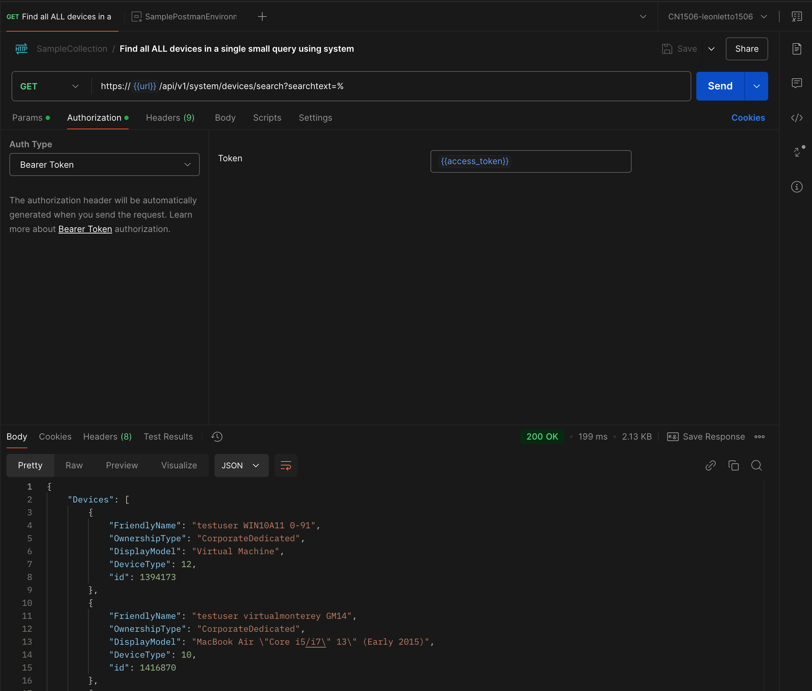

The headers are a little different since you need to set the aw-tenant-code to your API key and the 
Accept header to application/json;version=2;

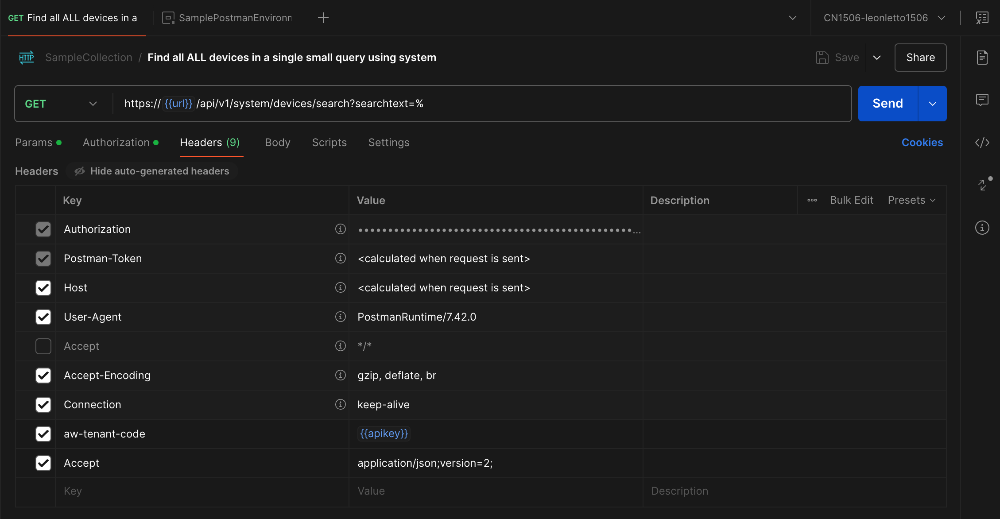

The Accept header determines what version of the API you are using.  When you go to your console under /api/help 
you can see the different versions that are supported.  In this case I am using System Management REST API V2.

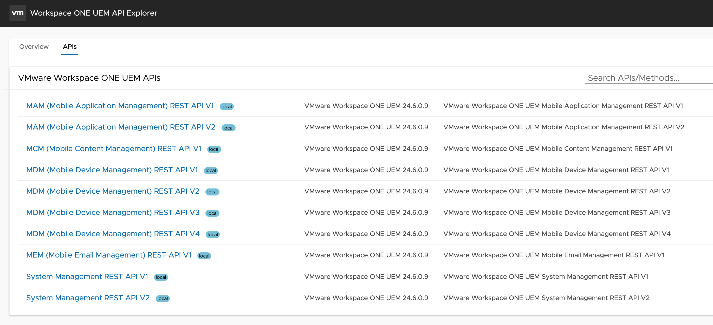


### 3.2 Using Python to call an API

Now that you have a bearer token, you can use it to make API calls.  Here is an example of the same request in Python.

Note that I am using the same function to get the bearer token as shown earlier. I am also
using a different header since the Accept header is different and you need to add aw-tenant-code with your API key.

```python
import os
import sys
from dotenv import load_dotenv
load_dotenv()
HOST = os.getenv("HOST")
API_KEY = os.getenv("API_KEY")

# Function to get devices list
def get_devices_list(headers):
    url = f"https://{HOST}/api/system/devices/search?searchtext=%"
    headers["Authorization"] = f'Bearer {get_bearer_token()}'
    response = make_request("GET", url, headers=headers)
    if response is None:
        sys.exit("Failed to get devices list.")
    return response.json()


headers = {
    "aw-tenant-code": API_KEY,
    "Accept": "application/json;version=2;"
}

print(get_devices_list(headers))
```

The full python script is available here: [get_devices.py](UEM-API-Workflows-media/get_devices.py)

### 3.3 Using PowerShell to call an API

Like with Python, I won't show the whole script here but will show the Get-DevicesList function and how to use it.

Again, I am using the same function to get the bearer token as shown earlier. I am also
using a different header since the Accept header is different and you need to add aw-tenant-code with your API key.

```powershell
# Function to get devices list  
function Get-DevicesList
{
    param (
        [hashtable]$headers
    )

    $bearer_token = Get-BearerToken
    $headers.Authorization = "Bearer $bearer_token"
    $url = "https://$( $env:HOST )/api/system/devices/search?searchtext=%"
    $response = Invoke-ApiRequest -Method "Get" -Uri $url -Headers $Headers
    if ($null -eq $response)
    {
        Write-Error "Failed to get devices list."
        exit 1
    }
    
    return $response
}

$headers = @{
    "aw-tenant-code" = $env:API_KEY
    "Accept" = "application/json; version=2"
}
$devices = Get-DevicesList -headers $headers
Write-Output $devices
```

The full PowerShell script is available here: [get_devices.ps1](UEM-API-Workflows-media/get_devices.ps1)

## Conclusion

In this blog post, we have explored how to securely manage API calls, tokens, and environment variables in Workspace ONE UEM. We have also looked at how to use Postman/Bruno, Python, and PowerShell to make API calls.

I have plans for some related blog posts:

- I will explore how to use LLMs to assist with development tasks such as generating code, converting between formats, and providing development support as well as explaining code.
- I will explore how to use Swagger files to help you understand the API options and generate code.
- I will also explore how to use cloud services such as Azure, AWS, and Google Cloud to store your secrets and manage your environment variables for production scripts.

See you next time.

Leon


