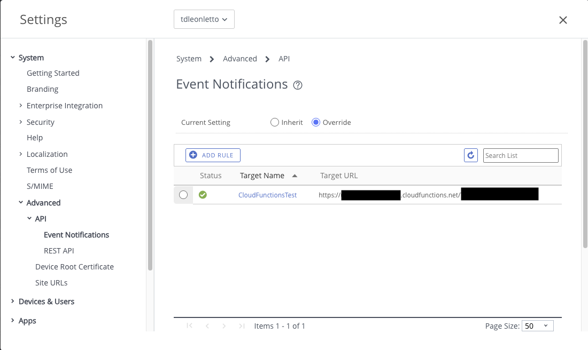
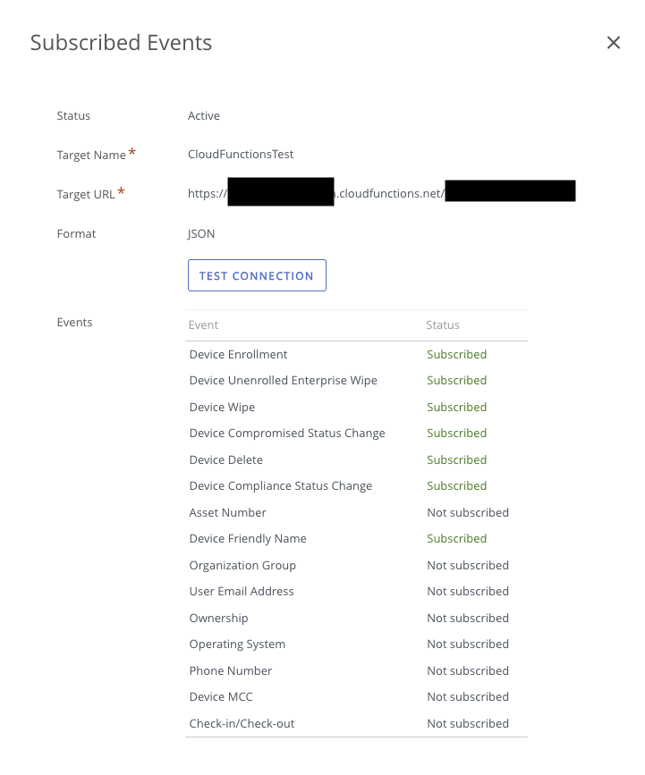
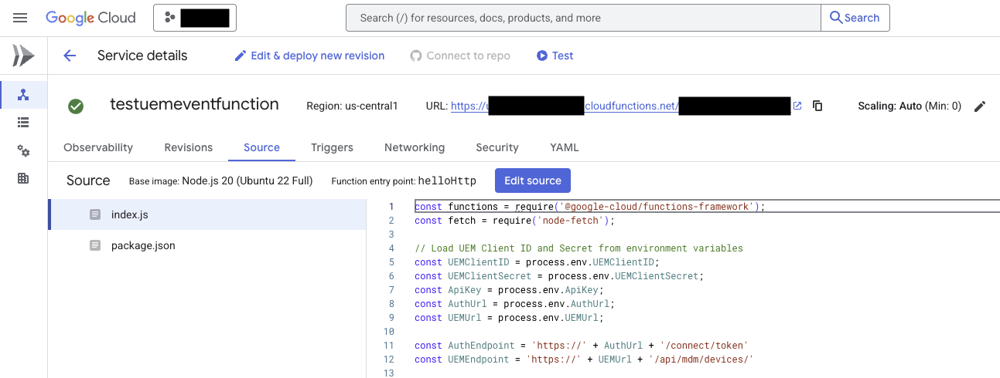
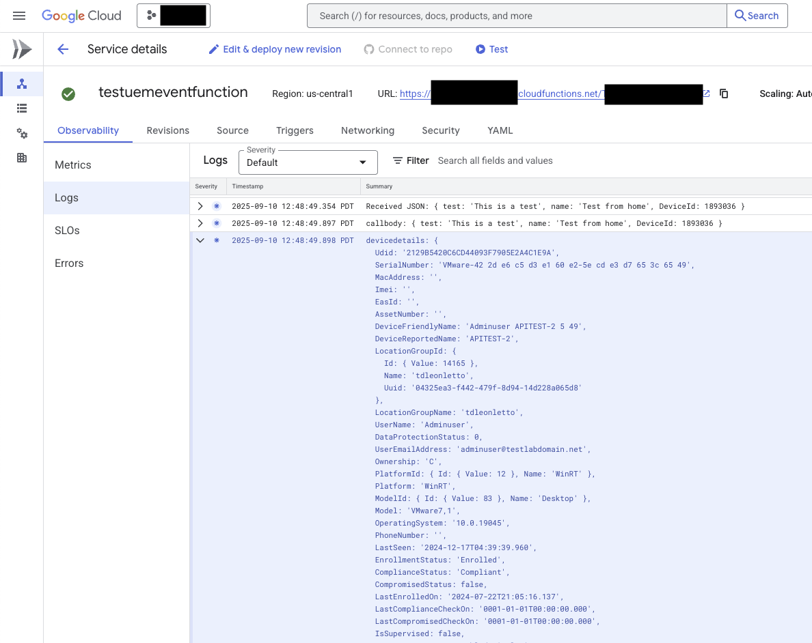

# Integrate Workspace ONE UEM with External Services Using Cloud Functions

When managing enterprise devices with Workspace ONE UEM, you often need to integrate device events and data with external systems like SIEM platforms, reporting databases, or internal NOC systems. This guide demonstrates how to create a serverless cloud function that automatically receives device events from UEM and enriches them with detailed device information for downstream processing.

The end result is a fully automated integration that captures device enrollment events, authenticates with the UEM API, retrieves comprehensive device details, and makes this data available for your external systems to consume.

## Why This Integration Matters

Modern enterprise environments require real-time visibility into device management events across multiple systems. Whether you're feeding data to:
- **SIEM systems** for security monitoring and compliance reporting
- **Internal dashboards** for NOC teams to track device health and enrollment status  
- **Reporting databases** for executive visibility into mobile device management
- **Ticketing systems** for automated incident creation based on device events

This cloud function approach provides a scalable, serverless solution that eliminates the need for dedicated infrastructure while ensuring reliable event processing.

## Prerequisites

Before implementing this integration, ensure you have:

1. **Workspace ONE UEM Console Access** with administrative privileges
2. **Cloud Platform Account** (Google Cloud, AWS, or Azure) with function deployment capabilities
3. **UEM API Credentials** including:
   - Client ID and Client Secret for OAuth authentication
   - API Key for UEM REST API access
   - UEM tenant URL and authentication endpoints
4. **Basic understanding** of REST APIs and JSON data structures

## Configure UEM Event Notifications

The first step is configuring Workspace ONE UEM to send event notifications to your cloud function endpoint.

1. **Log into the Workspace ONE UEM console**
2. **Navigate to System > Advanced > API > Event Notifications**
   
    a. **Click "Add Rule" to create a new notification rule**

    
    
    b. **Configure the notification endpoint**:
      - **URL**: Enter your cloud function trigger URL (you'll get this after deploying the function)
      - **Method**: Select POST
      - **Authentication**: Choose "No Auth" for initial testing (enable authentication in production)
      - **Format**: Select JSON
      - **Select the events to monitor eg.**:
        - **Device Enrollment**: Captures when devices are enrolled
        - **Device Compliance Changes**: Monitors compliance status updates  
        - **Device Deletions**: Tracks when devices are removed from management
        - **Device Attribute Changes**: Monitors changes to device properties

3. **This is the result**
   
    


4. **Configure the JSON payload** Good selection to include for a SIEM:
   - Device Friendly Name
   - Device Compliance Status
   - Device Compromised Status Change
   - Device Delete
   - Device Enrollment
   - Device Unenrolled Enterprise Wipe
   - Device Wipe

5. **Save the notification rule**

## Create the Cloud Run Function

Cloud Functions has been renamed to Cloud Run functions. 

For more information, and to see how to setup, see the Cloud Run functions blog post.

[google-cloud-functions-is-now-cloud-run-functions](https://cloud.google.com/blog/products/serverless/google-cloud-functions-is-now-cloud-run-functions)

Now we'll create the serverless function that processes UEM event notifications and enriches them with detailed device information.

### Function Architecture

The cloud run function follows this workflow:
1. Receives POST request from UEM with basic event data
2. Extracts device ID from the event payload
3. Authenticates with UEM using OAuth 2.0
4. Calls UEM REST API to retrieve detailed device information
5. Logs the enriched data for downstream processing

### Environment Variables Setup

Configure these environment variables in your cloud function:

```bash
UEMClientID=your_oauth_client_id
UEMClientSecret=your_oauth_client_secret
ApiKey=your_uem_api_key
AuthUrl=your-tenant.awmdm.com
UEMUrl=your-tenant.awmdm.com
```

Note: The `AuthUrl` and `UEMUrl` should contain only the domain name without the protocol (https://) as the function constructs the full URLs internally.

### Function Implementation

Here's the core cloud function code based on the demonstration:

```javascript
const functions = require('@google-cloud/functions-framework');
const fetch = require('node-fetch');

// Load UEM Client ID and Secret from environment variables
const UEMClientID = process.env.UEMClientID;
const UEMClientSecret = process.env.UEMClientSecret;
const ApiKey = process.env.ApiKey;
const AuthUrl = process.env.AuthUrl;
const UEMUrl = process.env.UEMUrl;

const AuthEndpoint = 'https://' + AuthUrl + '/connect/token'
const UEMEndpoint = 'https://' + UEMUrl + '/api/mdm/devices/'

functions.http('helloHttp', async (req, res) => {
  try {
    // Log the received JSON
    console.log('Received JSON:', req.body);

    // Extract the DeviceId from the request body
    const { DeviceId } = req.body;

    // Authenticate using OAuth to get the access token
    const tokenResponse = await fetch(AuthEndpoint, {
      method: "POST",
      headers: {
        "Content-Type": "application/x-www-form-urlencoded",
        "User-Agent": "Chrome",
        "Accept": "application/json"
      },
      body: new URLSearchParams({
        "grant_type": "client_credentials",
        "client_id": UEMClientID,
        "client_secret": UEMClientSecret
      })
    });

    const tokenData = await tokenResponse.json();
    const accessToken = tokenData.access_token;

    // Use the access token to call the Workspace ONE API to get device details
    const deviceResponse = await fetch(`${UEMEndpoint}${DeviceId}`, {
      method: "GET",
      headers: {
        "aw-tenant-code": ApiKey,
        "Accept": "application/json;version=1;",
        "Authorization": `Bearer ${accessToken}`
      }
    });

    const deviceDetails = await deviceResponse.json();

    // Log the original body and device details
    console.log('callbody:', req.body);
    console.log('devicedetails:', deviceDetails);

    // Send a response back
    res.status(200).send(`Hello ${req.body.name || 'World'}!`);
  } catch (error) {
    console.error('Error:', error);
    res.status(500).send('An error occurred');
  }
});
```

### Package Dependencies

Create a `package.json` file with the required dependencies:

```json
{
  "name": "uem-event-handler",
  "version": "1.0.0",
  "description": "Cloud function to process UEM event notifications",
  "main": "index.js",
  "dependencies": {
    "@google-cloud/functions-framework": "^3.0.0",
    "node-fetch": "^2.6.7"
  },
  "scripts": {
    "start": "functions-framework --target=helloHttp"
  }
}
```

## This is what the function looks like in the cloud console.



## Deploy and Test the Integration

### Deployment Steps

1. **Install the Google Cloud CLI** if you haven't already
2. **Create a new directory** for your function and add the `index.js` and `package.json` files
3. **Deploy the function** using the gcloud command:

```bash
gcloud functions deploy uem-event-handler \
  --runtime nodejs18 \
  --trigger-http \
  --allow-unauthenticated \
  --entry-point helloHttp \
  --set-env-vars UEMClientID=your_client_id,UEMClientSecret=your_client_secret,ApiKey=your_api_key,AuthUrl=your-tenant.awmdm.com,UEMUrl=your-tenant.awmdm.com
```

4. **Copy the function trigger URL** from the deployment output for UEM configuration

### Testing the Integration

1. **Update the UEM Event Notification** with your function's trigger URL
2. **Enroll a test device** in UEM to trigger the event
3. **Monitor the cloud function logs** to verify event processing



### Verification Steps

After device enrollment, you should see:
1. **Initial event log** showing the UEM notification payload
2. **Authentication success** log entry
3. **Device details retrieval** with complete device information
4. **Enriched event data** ready for downstream processing

Example log output:
```json
{
  "original_event": {
    "EventType": "EnrollmentComplete",
    "DeviceId": "1893036",
    "DeviceFriendlyName": "Test-Device-VM",
    "ComplianceStatus": "Compliant"
  },
  "device_details": {
    "Id": {"Value": 1893036},
    "Udid": "device-unique-identifier",
    "SerialNumber": "VM123456789",
    "DeviceFriendlyName": "Test-Device-VM",
    "Platform": "WinRT",
    "Model": "Virtual Machine"
  }
}
```

## Next Steps and Advanced Configurations

### Production Considerations

1. **Enable Authentication**: Configure proper authentication for the webhook endpoint
2. **Error Handling**: Implement retry logic and dead letter queues
3. **Rate Limiting**: Add throttling to handle high-volume events
4. **Monitoring**: Set up alerts for function failures and API errors

### Integration Examples

- **SIEM Integration**: Forward enriched events to Splunk, QRadar, or Azure Sentinel
- **Database Storage**: Store device events in PostgreSQL or MongoDB for reporting
- **Notification Systems**: Send alerts to Slack or Microsoft Teams for critical events

## Additional Resources for Technical Background

For readers who need more background on the underlying technologies:

### OAuth 2.0 Authentication
- [Workspace ONE UEM API Authentication](https://docs.omnissa.com/bundle/WorkspaceONE-UEM-Console-BasicsVSaaS/page/UsingUEMFunctionalityWithRESTAPI.html) - Official documentation for UEM API authentication

### Cloud Functions and Serverless
- [Google Cloud Functions Documentation](https://cloud.google.com/functions) - Getting started with serverless functions
- [Serverless Architecture Patterns](https://cloud.google.com/serverless) - Best practices for serverless implementations

### SIEM Integration Patterns in UEM for standard information
- [Workspace ONE UEM SIEM Integration](https://docs.omnissa.com/bundle/SystemSettingsV2310/page/SystemLogSettings.html) - Official guide for SIEM integration
- [Event-Driven Architecture Best Practices](https://cloud.google.com/eventarc/docs/overview) - Designing robust event processing systems

This integration provides a foundation for real-time device management visibility across your enterprise systems. The serverless approach ensures scalability while minimizing infrastructure overhead, making it ideal for organizations of any size.
