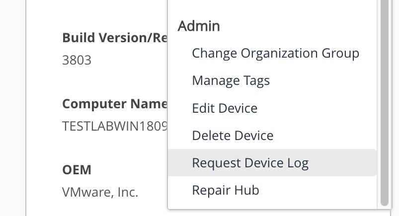
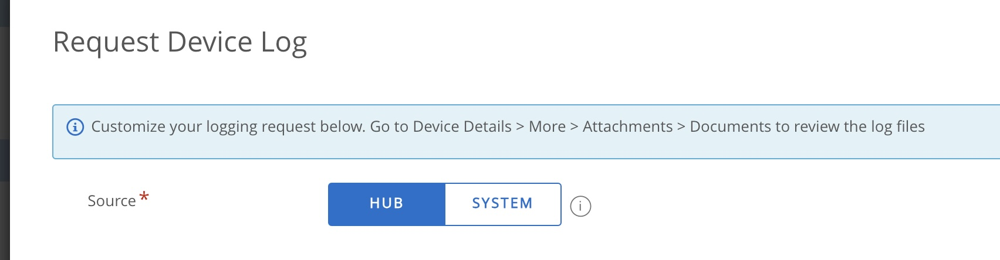
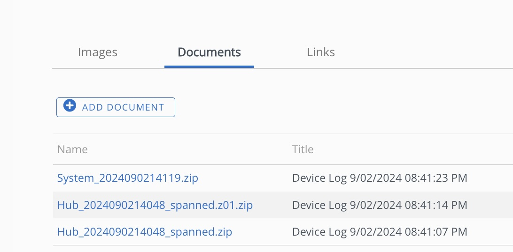

# Prepare Workspace ONE Windows Logs for LNAV

When you request logs from Workspace One UEM, if the logs are large, they end up being combined into multi-part zip files. This 
is a guide to unzip those logs for viewing in LNAV.  As you can see below, the end result is a single zip file of all the logs
from the device.  

You can then use LNAV to view the logs in a text viewer.  LNAV can handle the final zip and you will see
meaningful filenames.  It is convenient but not required to have them unzipped if you want to open the logs in a text viewer for 
presenting to others.  I will show this as the last step in teh process.

## Get the logs from the Workspace ONE UEM console

1. Log into the Workspace ONE UEM console
2. Navigate to Devices > List View > Select the device you want to troubleshoot
3. Click on the More Actions button and select Request Device Log

4. Select the log level you want to collect ( Hub or System ) and click Request Log

5. You can request both logs
6. Wait for the logs to be collected and zipped

7. Download the logs to a folder on your computer
8. If the logs are large: 
   - they will be multi-part zip files.  
   - UEM adds a .zip to the extended files like .z01.zip, .z02.zip, etc.
   - rename the files to remove the .zip extension so that they are .z01, .z02, etc.
   - unzip the files using 7zip or another tool that can handle multi-part zip files
9. If you are on a Mac you can use brew to install p7zip and then use the command line to unzip the files
   - `brew install sevenzip`
   - `7zz x filename.zip`

Example for MacOs or Linux step by step:
```bash
> ls -l
total 35496
-rw-r--r--@ 1 leon  staff  9728000 Sep  2 13:43 Hub_2024090214048_spanned.z01.zip
-rw-r--r--@ 1 leon  staff  6844784 Sep  2 13:43 Hub_2024090214048_spanned.zip
-rw-r--r--@ 1 leon  staff   256007 Sep  2 13:42 System_2024090214119.zip

mv Hub_2024090214048_spanned.z01.zip Hub_2024090214048_spanned.z01

> 7zz x Hub_2024090214048_spanned.zip

7-Zip (z) 24.08 (arm64) : Copyright (c) 1999-2024 Igor Pavlov : 2024-08-11
 64-bit arm_v:8.5-A locale=en_US.UTF-8 Threads:10 OPEN_MAX:256, ASM

Scanning the drive for archives:
1 file, 6844784 bytes (6685 KiB)

Extracting archive: Hub_2024090214048_spanned.zip
--
Path = Hub_2024090214048_spanned.zip
Type = zip
Physical Size = 6844784
Embedded Stub Size = 4
Total Physical Size = 16572784
Multivolume = +
Volume Index = 1
Volumes = 2

Everything is Ok

Size:       17798724
Compressed: 16572784

> ls -l
total 69256
-rw-r--r--@ 1 leon  staff   9728000 Sep  2 13:43 Hub_2024090214048_spanned.z01
-rw-r--r--@ 1 leon  staff   6844784 Sep  2 13:43 Hub_2024090214048_spanned.zip
-rw-r--r--@ 1 leon  staff    256007 Sep  2 13:42 System_2024090214119.zip
drwx------  3 leon  staff        96 Sep  2 13:58 Windows

> ls Windows/TEMP/Diagnostics_VMWare_Hub_gryb1xv1.dbv
Hub_2024090214048.zip
```

10. if you are on Linux you can download 7-zip from 7-zip.org and then use the command line to unzip the files
   - go to [7zip Downloads](https://www.7-zip.org/download.html)
   - right click on the link for the Linux version and copy the link
   - use wget to download it to your computer
   - `wget https://7-zip.org/a/7z2408-linux-x64.tar.xz`
   - extract the files into /usr/local/bin
   - `sudo tar -xvf 7z2408-linux-x64.tar.xz -C /usr/local/bin`
   - now you can use 7zz in the same way as on the Mac above

11. If you are on Windows you can use install 7zip to unzip the files and then use the 7zip GUI to extract the files after renaming them as in step 8.
   - [7zip Downloads](https://www.7-zip.org/download.html)

12. Now you will see a Windows folder with the actual zip file which will be named something like Hub_2024090214048.zip ( without the spanned part )
13. This file is the final zip file that contains all the logs from the device.
14. I would recommend moving that file to a folder where you keep your logs so that you can easily find it later.  Then you can delete the spanned files.
15. You can now open the logs in LNAV or unzip them and view them in a text viewer.


### Example script to rename and unzip the final files on MacOS or Linux into the current directory

The following script can be used to rename the spanned zip files and extract the final zip file from the spanned 
zip files. Save the script to a file, make it executable with `chmod +x script.sh`, and run it in the 
directory where the spanned zip files are located.

```bash
#!/bin/bash

# Function to check if 7zz (7-Zip) is installed
check_7zip_installed() {
    if ! command -v 7zz &> /dev/null; then
        echo "7zz (7-Zip) is not installed."
        echo "You can install it via Homebrew by running 'brew install sevenzip'"
        echo "or download it from https://www.7-zip.org/"
        exit 1
    fi
}

# Function to rename .z01.zip to .z01, .z02.zip to .z02, etc.
rename_zip_parts() {
    for file in *.z[0-9][0-9].zip; do
        if [[ -f "$file" ]]; then
            # Get the base name without the .zip extension
            new_name="${file%.zip}"
            echo "Renaming $file to $new_name"
            mv "$file" "$new_name"
        fi
    done
}

# Function to extract the final zip file from the spanned zip files
extract_zip_files() {
    for zip_file in *_spanned.zip; do
        if [[ -f "$zip_file" ]]; then
            echo "Extracting contents of $zip_file"

            # Extract all contents of the spanned zip files to a temporary directory
            temp_dir=$(mktemp -d)
            7zz x "$zip_file" -o"$temp_dir"

            if [[ $? -ne 0 ]]; then
                echo "Error extracting $zip_file. Please check the file integrity."
                exit 1
            fi

            # Find the .zip file within the extracted contents
            found_zip=$(find "$temp_dir" -type f -name "*.zip")

            if [[ -z "$found_zip" ]]; then
                echo "No zip file found inside $zip_file. Skipping."
                # Clean up the temporary directory
                rm -rf "$temp_dir"
                continue
            fi

            # Move the found .zip file(s) to the current directory
            echo "Moving $found_zip to current directory."
            mv "$found_zip" ./

            if [[ $? -ne 0 ]]; then
                echo "Error moving $found_zip. Please check permissions."
                rm -rf "$temp_dir"
                exit 1
            fi

            # Clean up the temporary directory
            rm -rf "$temp_dir"
            echo "Successfully extracted and moved $found_zip to the current directory."
        fi
    done
}

# Main script execution
check_7zip_installed
rename_zip_parts
extract_zip_files

echo "Extraction completed successfully."

exit 0
```


## Using LNAV to view the logs

Please see my other post on [Using LNAV to troubleshoot devices in Workspace ONE](/Blog/lnav.html) for more information on how to use LNAV to view the logs.