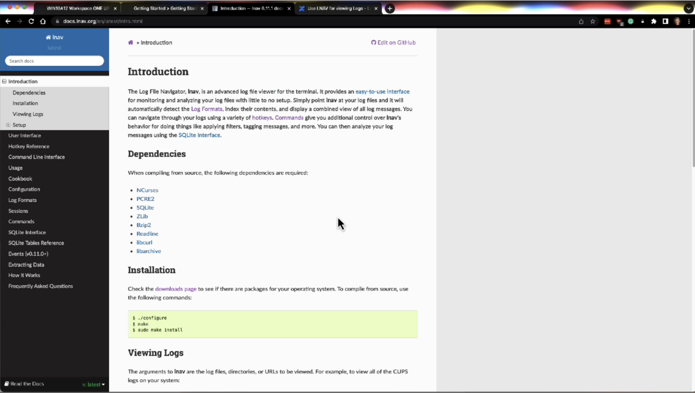
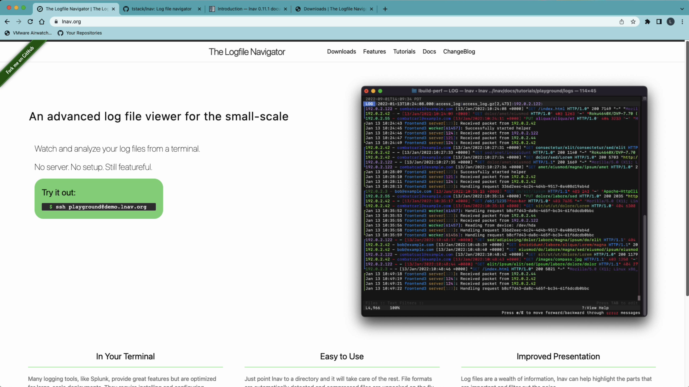
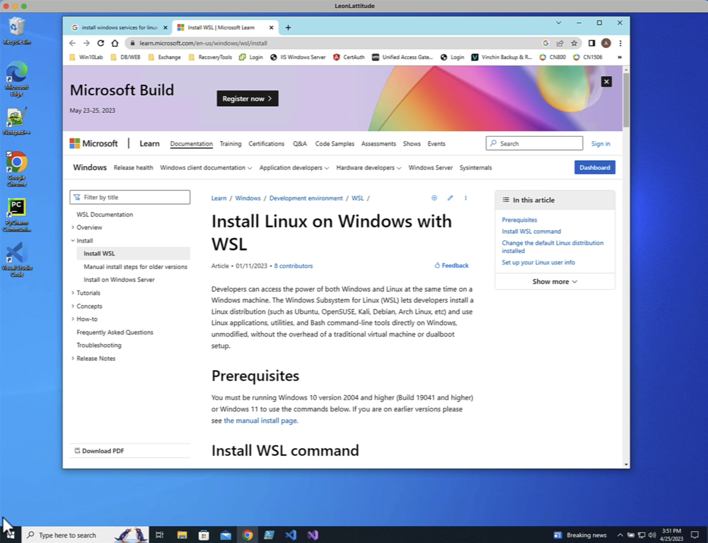

# using LNAV

Not sure how I missed this years ago, but this is the best log viewer I have seen for looking at Hub Logs, etc. You can load a full log bundle WITHOUT unzipping it, and the viewer will load the whole bundle, parse the logs, and display all entries in timestamp order across all files.

EG. When you find an error message, all the related messages from all logs will be nearby and easy to find.

## Demo

Here is a demo I have recorded showing how powerful this is when troubleshooting. It's 10 minutes and covers some of the use cases I have found.

[](media/LNAVDemo720p.mp4)

## Quick Install Video

Here is a 5-minute overview of getting it installed on a Mac and using it for the first time.

[](media/InstallVideo.mp4)

## Running on Windows

Lnav is a UNIX tool that runs on macOS and Linux, so if you have a Windows laptop as your main computer, you will need to install WSL (Windows Services for Linux) to use the tool. I have created a 10-minute tutorial here to show you how to set up WSL and then set up lnav plus my conversion utility.

NOTE: The version of LNAV in the apt repo for WSL is old, and you should follow this guide on installing it to get a good version.

[Install LNAV on Ubuntu](https://snapcraft.io/install/lnav/ubuntu)

My parsers don't work on the old version, and you will be frustrated.

[](media/LNAVOnWindows.mp4)

## Documentation

- [Main LNAV web page](https://docs.lnav.org/en/latest/intro.html)
- [Great Blog post on the benefits of troubleshooting](https://innolitics.com/articles/graduate-from-sed-and-sort-to-lnav-the-logfile-navigator/)

### Log format for Workspace ONE Hub Logs

Use these files to configure LNAV to parse Workspace ONE logs:

1. Support for the JSON formatted Windows hub logs.
   - [AllWindowsParsers.json](media/AllWindowsParsers.json)

2. Support for a couple of Mac system log files that have different timestamps.
   - [WSOneMacHubLogs.json](media/WSOneMacHubLogs.json)

3. Support for UEM logs from our UEM servers. This one will be updated and expanded over time as changes happen.
   - [WSOneServerLogsParsers.json](media/WSOneServerLogsParsers.json)

4. Support for Horizon Logs (some special timestamps there).
   - [WSOneHorizonLogs.json](media/WSOneHorizonLogs.json)

Once you have installed LNAV, you can import these files globally like so:

```bash
lnav -i WSOneWindowsHubLogFormat.json
```

### Here is a good example of how to create your own formatted log files that are not standard

If you want to play and contribute.

[Weird format and how to parse it.](https://gist.github.com/wsargent/9bfc52badcaa1170488bb66e45c8d778)

#### BTW - if you want to use your mouse for scrolling up and down in the window, this discusses how to make that happen

[Stack Overflow discussion](https://stackoverflow.com/questions/36594420/how-can-i-turn-off-scrolling-the-history-in-iterm2)

#### Note: This tool is 13 years old, and I only wish I had found it sooner!

[First Commit in Github](https://github.com/tstack/lnav/commits/master?after=33f0cc51b97f82f58de90e30e8ed840b4f59b461+2659&branch=master&qualified_name=refs%2Fheads%2Fmaster)

Tip - Export the data you see so you can share it without sharing the whole log
-------------------------------------------------------------------------------

This uses the `:partition-name` command. (see [LNAV Bookmarks Documentation](https://lnav.readthedocs.io/en/latest/commands.html#bookmarks))

Here's the flow:

1.  Make the start of the region you're interested in the top line in the log view.
2.  Set the name of the region with `:partition-name myregion1`
3.  Make the end of the region you're interested in the top line in the log view.
4.  Set the name of the next region with `:partition-name myregion2`

Once the region is defined, you can do a `SELECT` based on the `log_part` column with the region's name.

sql

Copy code

`SELECT log_text FROM all_logs WHERE log_part = 'myregion1'`

Then, you can use the `:write-raw-to` command in the SQL view to write the messages to a file.

bash

Copy code

`:write-raw-to /tmp/myregion1.log`

The only issue is the missing context of where the logs come from since this output file contains the log entries and not the filenames. But if you are sharing with someone, it will be good enough, I think.

Step-by-step guide
------------------

Installation is very easy if you just want to use the binary they provide:

1.  Download the zip file
2.  Unzip it
3.  Copy lnav to your `/usr/local/bin` folder
4.  Install the parsers above
5.  Run `lnav -r` your log files

#### Quick tips for navigation on your keyboard:

*   `g` - go to the top (or earliest) of your logs
*   `G` - go to the end of your logs
*   `←` - move to the left showing the filenames
*   `→` - move to the right to see longer lines in your log files
*   `i` - show/hide histogram view of your logs (summarized every 5 minutes)
*   `t` - show/hide text files such as config files which are part of your log bundle

[Link to all the other hotkeys for navigation.](https://docs.lnav.org/en/latest/hotkeys.html)

### Important note:

Don't forget to change your "ulimit" (the number of files your operating system can open) because LNAV opens lots of files to do its magic of highlighting the screen and building out options. Also, it will crash if you open a large log bundle with hundreds of files because it runs out of file descriptors.

To fix your current terminal session, run the following command:

bash

Copy code

`ulimit -n 10240`

This will allow you to open 10240 files at the same time.

To make this automatic, add it to your `~/.zshrc` if you're on a Mac or `~/.bashrc` if you're on Linux:

bash

Copy code

`vim ~/.zshrc   # hit the i key to edit    # add this   # update number of files allowed open   ulimit -n 10240    :wq # to save the file`
